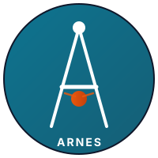

<!--
  Social preview metadata. GitHub uses the repo's social card (set in
  Settings → Social preview) for link unfurls; this PNG is the asset we
  upload there. The Open Graph / Twitter tags below are also picked up by
  some third-party renderers that parse the raw README.
-->
<meta property="og:title" content="ARNES — The Open Agent Harness" />
<meta property="og:description" content="Write the manual. ARNES compiles it into a team of specialists that follows it to the letter." />
<meta property="og:image" content="https://raw.githubusercontent.com/frangelbarrera/ARNES/main/docs/social-card.png" />
<meta property="og:url" content="https://github.com/frangelbarrera/ARNES" />
<meta property="og:type" content="website" />
<meta name="twitter:card" content="summary_large_image" />
<meta name="twitter:title" content="ARNES — The Open Agent Harness" />
<meta name="twitter:description" content="Write the manual. ARNES compiles it into a team of specialists that follows it to the letter." />
<meta name="twitter:image" content="https://raw.githubusercontent.com/frangelbarrera/ARNES/main/docs/social-card.png" />

<div align="center">



# ARNES

### The Open Agent Harness

**Write the manual. ARNES compiles it into a team of specialists that follows it to the letter.**

[](https://www.python.org/downloads/)
[](https://opensource.org/licenses/Apache-2.0)
[](https://github.com/frangelbarrera/ARNES/actions)
[](https://github.com/frangelbarrera/ARNES#readme)
[](https://github.com/frangelbarrera/ARNES/discussions)
[](https://github.com/frangelbarrera/ARNES)

[Manifesto](MANIFESTO.md) · [Documentation](https://github.com/frangelbarrera/ARNES#readme) · [Examples](examples/) · [Contributing](CONTRIBUTING.md)

</div>

---

> **If your framework needs a debugger for your debugger, it is the wrong framework.**

ARNES is not a framework. It is a **harness**: the control layer that lets you
orchestrate AI agents without surrendering your prompts, your context, your
model, or your money.

We do not ask you to learn magic classes. We ask you to write a manual in
YAML. We compile it into a DAG of specialists, run it with cost guardrails
and anti-hallucination middleware, and return an auditable bitácora.

```bash
git clone https://github.com/frangelbarrera/ARNES.git
cd ARNES
uv sync --all-extras --dev
uv run arnes run manuals/hello-world.yaml --mock
```

---

## Why ARNES exists

Agent frameworks in 2024–2026 share three defects:

1. **They are black boxes.** You cannot read the prompt sent to the LLM. You
   cannot see what decision the model router made. You cannot diff your agent
   stack.
2. **They have vendor lock-in.** If a feature only exists in OpenAI or only
   in Anthropic, they expose it as a first-class API. Your code gets tied
   to that vendor.
3. **They do not respect your money.** Without real budget enforcement, an
   agent can burn $50 in 90 seconds without you knowing until the bill
   arrives.

ARNES attacks all three. And it adds something nobody else does: **the
manual is the code.**

---

## What it looks like

```
    ___
   /   |  _________ ___   _______
  / /| | / ___/ __ `__ \ / ___/ /
 / ___ |/ /  / / / / / // /__/ /
/_/  |_/_/  /_/ /_/ /_/ \____/_/
        The Open Agent Harness
```

A manual in YAML:

```yaml
# manuals/audit-pr.yaml
name: audit-pr
objective: Audit a Pull Request in a structured way
budget_usd: 0.50

steps:
  - id: read_diff
    specialist: "@reviewer"
    input:
      pr_number: 1234
      repo: "my-org/my-repo"
      focus: "Read the diff and structure it for analysis"

  - id: security_audit
    specialist: "@reviewer"
    input: "{{ steps.read_diff.output }}"
    focus: "Security review: auth flows, SQL injection, XSS, path traversal"
    if_not_met:
      action: call
      specialist: "@reviewer"
      input:
        focus: "Comment that the PR is blocked by security review"

  - id: parallel
    parallel:
      - id: lint
        specialist: "@reviewer"
        input:
          code: "{{ steps.read_diff.output }}"
          focus: "Code quality: idioms, naming, complexity"
      - id: tests
        specialist: "@tester"
        input:
          code: "{{ steps.read_diff.output }}"
          focus: "Verify tests cover the PR changes"

  - id: synthesis
    specialist: "@reviewer"
    input:
      diff: "{{ steps.read_diff.output }}"
      security: "{{ steps.security_audit.output }}"
      lint: "{{ steps.parallel.lint.output }}"
      tests: "{{ steps.parallel.tests.output }}"
      focus: "Synthesize into a final verdict: approve / request_changes / reject"
```

You run it (mock LLM, no network, $0 cost):

```bash
$ arnes run manuals/hello-world.yaml --mock
```

ARNES compiles the manual into a DAG, wakes the specialists in sequence,
applies token optimization and verification layer on every LLM call, and
returns:

```
╭────────────────────────────────────────────────────────────────────╮
│ ARNES — Executing playbook                                         │
│   Name: hello-world                                                │
│   Objective: Demonstrate the basic ARNES flow with a simple manual │
│   Model: ollama/llama3.2                                           │
│   Budget: $0.50                                                    │
╰────────────────────────────────────────────────────────────────────╯
2026-07-30 16:42:44 [info] llm_call_tracked  budget=0.5 cost_usd=0.0 \
      model=ollama/llama3.2 tokens_in=335 tokens_out=15 total_spent=0.0
2026-07-30 16:42:44 [info] llm_call_tracked  budget=0.5 cost_usd=0.0 \
      model=ollama/llama3.2 tokens_in=370 tokens_out=38 total_spent=0.0

✅ Manual executed

Steps executed: 2
Steps failed: 0
Duration: 0.01s
Tokens in/out: 705/53
Total cost: $0.0000

Bitácora saved to: bitacora-hello-world-20260730-164244.md
```

The bitácora is a markdown file with every step, every decision, every prompt
sent, every response received. You can diff it, version it, share it:

````markdown
# Bitácora ARNES — Thread 0b6ac82e-2600-42f5-a6ca-62e016df7961

**Total events:** 7

## [2026-07-30T16:42:44] step_started
**Step:** `plan`  ·  **Specialist:** `@planner`

## [2026-07-30T16:42:44] assistant_message
**Step:** `plan`  ·  **Specialist:** `@planner`
```json
{
  "model": "ollama/llama3.2",
  "tokens_in": 335,
  "tokens_out": 15,
  "cost_usd": 0.0,
  "cached": false
}
```

## [2026-07-30T16:42:44] step_completed
...
````

Want to see the whole flow end-to-end? Run the narrated demo script:

```bash
./scripts/demo.sh            # print to terminal
./scripts/demo.sh --record demo.tape && vhs demo.tape   # render a GIF
```

See [Recording a demo GIF](#recording-a-demo-gif) below for the `vhs` and
`agg` recipes.

---

## Features

| Category | Feature | Status |
|---|---|---|
| **Agent loop** | Stateless reducer `(state, event) → state` | ✅ v0.1 |
| | ReAct tool-use loop in specialists | ✅ v0.1 |
| | AG-UI streaming compatible | 🚧 v0.2 |
| **Specialists** | 5 pre-built (planner, coder, reviewer, tester, debugger) | ✅ v0.1 |
| | 5 more (security, devops, researcher, writer, optimizer) | 🚧 v0.3 |
| **Playbook DSL** | Declarative YAML compiled to DAG | ✅ v0.1 |
| | Conditional branches (`if_not_met`) | ✅ v0.1 |
| | Parallel branches (true `asyncio.gather`) | ✅ v0.1 |
| | Retry with backoff | 🚧 v0.2 (schema defined, execution pending) |
| | HITL gates (pause and request approval) | ⚠️ v0.1 (auto-reject in non-interactive) |
| **MCP** | ARNES as MCP server (Claude Desktop, Cursor, Cline, Zed) | ✅ v0.1 |
| | ARNES as MCP client (consume external MCP servers) | 🚧 v0.2 |
| | HTTP/SSE transport | 🚧 v0.2 (stdio only in v0.1) |
| **Token Optimization** | Automatic model routing by complexity | ✅ v0.1 |
| | Semantic cache | ✅ v0.1 |
| | Context compaction | 🚧 v0.2 |
| | Few-shot pruning | 🚧 v0.3 |
| **Verification Layer** | Structured outputs with pydantic | ✅ v0.1 |
| | Refusal pattern (no hallucination, says "I don't know") | ✅ v0.1 |
| | Confidence gate | 🚧 v0.2 |
| | Critic loop (second opinion) | 🚧 v0.3 |
| | Grounding RAG optional | 🚧 v0.4 |
| **Cost Guard** | Hierarchical budget (org → project → agent → task) | ✅ v0.1 |
| | Temporal circuit breaker (max USD/min) | ✅ v0.1 |
| | Automatic model fallback | ✅ v0.1 |
| | Cost HITL (pause at X% exceeded) | ⚠️ v0.1 (log warning, auto-pause pending) |
| **Sandbox** | Docker hardened (Tier 1 dev-local) | ✅ v0.1 (auto-detected when `docker` is on PATH; falls back to gated local exec via `ARNES_DEV_MODE=1`) |
| | gVisor (Tier 2 production) | 🚧 v0.4 |
| **Multi-agent** | Single-agent default | ✅ v0.1 |
| | Crew (sequential/hierarchical) | 🚧 v0.4 |
| | A2A with trust | 🚧 v0.5 |
| **Observability** | Structured event log | ✅ v0.1 |
| | Auditable markdown bitácora | ✅ v0.1 |
| | OpenTelemetry exporter | 🚧 v0.3 |
| **Benchmarks** | BenchmarkRunner with multi-seed + concurrent + p95 | ✅ v0.1 |

---

## ARNES vs the rest

| Dimension | LangChain | CrewAI | OpenAI Agents SDK | **ARNES** |
|---|---|---|---|---|
| How you define agents | Python procedural | `Agent/Crew/Task` classes | `@agent` decorator | **Declarative YAML** |
| Distribution | pip library | pip library | pip library (OpenAI-only) | **MCP server + library** |
| Pre-built specialists | ❌ | ❌ | ❌ | **✅ 5–12 ready** |
| Curated playbooks | ❌ | ❌ | ❌ | **✅ 30–50 manuals** |
| Token optimization | Manual | ❌ | ❌ | **✅ Automatic middleware** |
| Anti-hallucination | DIY | ❌ | ❌ | **✅ 5 opt-in layers** |
| Budget enforcement | `max_tokens` basic | `max_tokens` basic | ❌ | **✅ Hierarchical + circuit breaker** |
| Vendor-neutral | Partial | ✅ | ❌ | **✅ 100% (default Ollama local)** |
| Prompts visible | ❌ | ❌ | ❌ | **✅ Files on disk** |
| Latam identity | ❌ | ❌ | ❌ | **✅ Born in Latam, built for the world** |

---

## Alignment with the 12-factor-agents manifesto

ARNES aligns explicitly with the [12 factors](https://github.com/humanlayer/12-factor-agents):

| Factor | Description | ARNES |
|---|---|---|
| 1 | Natural language > structured language | ✅ Declarative YAML |
| 2 | Tools are structured outputs | ✅ Pydantic schemas |
| 3 | Give agents composable, discrete tools | ✅ Specialist registry |
| 4 | Agents are switching loops, not while loops | ✅ Event-driven reducer |
| 5 | Simple but powerful primitives | ✅ Thread + Specialist + Tool |
| 6 | Use the right tool for the job | ✅ Model routing |
| 7 | Humans are tools, not gates | ✅ HITL as a typed tool call |
| 8 | Make agents easy to debug | ✅ Markdown bitácora |
| 9 | Make agents observable | ✅ Event log + OTel (v0.3) |
| 10 | Replayable from any point | ✅ Stateless reducer + checkpoint |
| 11 | Be a state machine, not a DAG | ⚠️ We are a DAG by design (declarative) |
| 12 | Deploy as a server, not a library | ✅ Native MCP server |

---

## Installation

ARNES is not yet on PyPI. Install from source with `uv` (recommended) or `pip`:

```bash
# With uv (recommended)
git clone https://github.com/frangelbarrera/ARNES.git
cd ARNES
uv sync --all-extras --dev

# With pip (editable)
git clone https://github.com/frangelbarrera/ARNES.git
cd ARNES
pip install -e ".[dev]"
```

## Quickstart (60 seconds)

```bash
# 1. Clone and install (see Installation above)

# 2. Create your first manual
arnes init --manual hello-world

# 3. Run it with the mock LLM (no network, $0 cost)
arnes run manuals/hello-world.yaml --mock

# 4. Stream a specialist's response token-by-token
arnes stream @planner --task "Plan a blog post about ARNES" --mock

# 5. Run it with Ollama local (free, requires `ollama pull llama3.2`)
arnes run manuals/hello-world.yaml

# 6. Stream playbook step events as they complete
arnes run manuals/hello-world.yaml --mock --stream

# 7. Benchmark every playbook (multi-seed, p95, concurrent)
arnes benchmark --seeds 5 --concurrent 4
```

If you do not have Ollama installed, ARNES detects it and guides you. To use
Anthropic/OpenAI, set the env var and ARNES does the rest:

```bash
export ANTHROPIC_API_KEY=sk-ant-...
arnes run manuals/audit-pr.yaml --model anthropic/claude-sonnet-4-20250514
```

---

## Architecture

```
┌──────────────────────────────────────────────────────────────┐
│   YOU (Claude Desktop / Cursor / CLI / Cline / Zed)            │
└────────────────────────┬─────────────────────────────────────┘
                         ▼
┌──────────────────────────────────────────────────────────────┐
│   ARNES MCP SERVER (1 install, 4 tools)                       │
│   run · list · events · resume                                │
└────────────────────────┬─────────────────────────────────────┘
                         ▼
┌──────────────────────────────────────────────────────────────┐
│   PLAYBOOK RUNTIME                                            │
│   YAML → Pydantic → DAG → Executor (conditional/parallel/HITL)│
└────────────────────────┬─────────────────────────────────────┘
                         ▼
┌──────────────────────────────────────────────────────────────┐
│   SPECIALIST REGISTRY (5–12 pre-built agents)                 │
│   planner · coder · reviewer · tester · debugger · ...        │
└────────────────────────┬─────────────────────────────────────┘
                         ▼
┌──────────────────────────────────────────────────────────────┐
│   CROSS-CUTTING MIDDLEWARE (all LLM calls pass through it)    │
│   🧠 Token Optimizer  🛡️ Verification  💰 Cost Guard          │
└────────────────────────┬─────────────────────────────────────┘
                         ▼
┌──────────────────────────────────────────────────────────────┐
│   LLM PROVIDERS (vendor-neutral, default Ollama local)        │
│   ollama · anthropic · openai · google · groq                 │
└──────────────────────────────────────────────────────────────┘
```

---

## Benchmark

ARNES ships a built-in benchmark runner that executes every playbook in
`manuals/` against a deterministic seeded mock LLM (no network, $0 spend)
and reports per-playbook success rate, avg/p95 duration, tokens, and cost.
Multi-seed runs give you statistical significance; concurrent runs let
you stress-test the executor's parallel-branch path.

```bash
# 1 seed, 1 concurrent (default — quick smoke test)
arnes benchmark

# 5 seeds per playbook (catch flaky playbooks)
arnes benchmark --seeds 5

# 4 playbooks at once (stress the asyncio.gather path)
arnes benchmark --concurrent 4

# Combined: 5 seeds × 4-way parallelism
arnes benchmark --seeds 5 --concurrent 4
```

Example output:

```
              Benchmark Results — basic suite
┏━━━━━━━━━━━━━━━━┳━━━━━━┳━━━━━━━━━┳━━━━━━━━━━━┳━━━━━━━━━━━┳━━━━━━━━━━━━┳━━━━━━━━━━━┓
┃ Playbook       ┃ Runs ┃ Success ┃ Avg dur   ┃ P95 dur   ┃ Avg tokens ┃ Avg cost  ┃
┡━━━━━━━━━━━━━━━━╇━━━━━━╇━━━━━━━━━╇━━━━━━━━━━━╇━━━━━━━━━━━╇━━━━━━━━━━━━╇━━━━━━━━━━━┩
│ hello-world    │    5 │    100% │    0.0089 │    0.0112 │        705 │ $0.000000 │
│ audit-pr       │    5 │    100% │    0.0241 │    0.0298 │       2104 │ $0.000000 │
│ debug-python   │    5 │    100% │    0.0187 │    0.0233 │       1583 │ $0.000000 │
│ write-feature  │    5 │    100% │    0.0312 │    0.0367 │       2431 │ $0.000000 │
└────────────────┴──────┴─────────┴───────────┴───────────┴────────────┴───────────┘

Overall: success=100%, avg_dur=0.0207s, avg_tokens=1706, avg_cost=$0.000000

Results saved to: benchmark-results.json
```

The JSON dump (default: `benchmark-results.json`, override with `--output`)
is suitable for diffing across commits or pasting into a PR description.

---

## Roadmap

- **v0.1.0 (Q1 2026)** — MVP: 5 specialists, 10 playbooks, basic DSL, MCP server, Token Optimizer v0, Verification v0, Cost Guard, Docker sandbox auto-detect, parallel branches via `asyncio.gather`.
- **v0.2.0** — Bidirectional MCP client, HITL as tool, AG-UI streaming, retry execution, full HTTP/SSE MCP transport.
- **v0.3.0** — Episodic memory, context compaction, critic loop, 5 more specialists.
- **v0.4.0** — Multi-agent Crew, PolicyEngine, gVisor sandbox.
- **v0.5.0** — ARNES as MCP server exposing playbooks to Cursor/Claude Desktop.
- **v1.0.0** — A2A with trust, auto-learning skills, playbook marketplace.

---

## Community

- **Discord:** coming soon — meanwhile, use GitHub Discussions for chat-style threads.
- **Discussions:** [GitHub Discussions](https://github.com/frangelbarrera/ARNES/discussions)
- **Issues:** [Bug reports and feature requests](https://github.com/frangelbarrera/ARNES/issues)
- **Contributing:** read [CONTRIBUTING.md](CONTRIBUTING.md) — we accept PRs from day one.

### Latam wedge

500M Spanish-speaking developers underserved by the current offering. ARNES
is born bilingual: README, docs, and quickstart in EN and ES. If you want
to contribute translations, open an issue with the `i18n` label.

---

## Contributing

Read [CONTRIBUTING.md](CONTRIBUTING.md). TL;DR:

1. Fork + clone
2. `uv sync --all-extras` for dev setup
3. `pre-commit install`
4. Create your branch: `feat/my-feature`
5. Conventional commits: `feat: ...`, `fix: ...`, `docs: ...`
6. `pytest` must pass with >65% coverage
7. Open PR — review within 48h

**Good first issues:** look for issues labeled `good-first-issue`.

---

## Sponsors

ARNES is 100% open-source under Apache 2.0. If it saves you money or time:

- [GitHub Sponsors](https://github.com/sponsors/frangelbarrera)
- [Open Collective](https://opencollective.com/arnes)
- [BuyMeACoffee](https://buymeacoffee.com/frangelbarrera)

<div align="center">

*Sponsors here*

</div>

---

## License

Apache License 2.0. See [LICENSE](LICENSE).

## Citation

If you use ARNES in academic research, please cite it. See [CITATION.cff](CITATION.cff) for the preferred citation format.

## Acknowledgments

ARNES stands on the shoulders of:
- [LangGraph](https://github.com/langchain-ai/langgraph) — DAG engine inspiration
- [LiteLLM](https://github.com/BerriAI/litellm) — provider abstraction
- [MCP SDK](https://github.com/modelcontextprotocol/python-sdk) — protocol
- [12-factor-agents](https://github.com/humanlayer/12-factor-agents) — manifesto
- [Pydantic](https://github.com/pydantic/pydantic) — structured data

---

<div align="center">

**[⭐ Star the repo](https://github.com/frangelbarrera/ARNES)** if this resonates.

*From Latam to the world. 🌎*

</div>

---

## Known Limitations in v0.1 (Alpha)

This is an **alpha release**. The following features are documented but have
known issues that will be fixed in v0.2:

- **HITL gates** auto-reject in non-interactive mode. Real interactive HITL
  (pausing execution and resuming on human input via the MCP transport)
  comes in v0.2. Until then, calling a HITL-gated tool without
  `interactive=True` returns a structured rejection rather than blocking.
- **LLM streaming** is implemented for all providers. `LLMProvider` declares
  `stream_complete()` (returns `AsyncIterator[LLMResponse]`). `MockLLMProvider`
  yields a single full-response chunk; `OllamaProvider` and `LiteLLMProvider`
  yield real token-by-token chunks. `CostGuard.stream_complete` tracks cost
  on the final chunk. Full per-chunk verification and semantic-cache
  population from streaming lands in v0.2.
- **MCP HTTP transport** is minimal (simple POST endpoint, no SSE). It
  *does* ship with bearer-token auth (`ARNES_MCP_TOKEN`), per-IP rate
  limiting (100 req/min), and a 1 MiB request size cap — but for production
  use the stdio transport is still recommended until full HTTP/SSE lands
  in v0.2.
- **Retry policy** schema is defined but execution is not yet implemented.
- **Context compaction** and **few-shot pruning** are not yet implemented.
- **Confidence gate** and **critic loop** are not yet implemented.

**What does work in v0.1:**
- ✅ Thread + stateless reducer pattern (append-only, O(1) per event)
- ✅ 5 specialists with ReAct tool-use loop
- ✅ Playbook DSL with conditionals and template resolution
- ✅ Parallel branches (true `asyncio.gather` concurrency, isolated Threads)
- ✅ CostGuard with budget enforcement and circuit breaker
- ✅ VerificationLayer with structured outputs and refusal pattern
- ✅ TokenOptimizer with model routing and semantic cache
- ✅ MCP server (stdio transport + minimal HTTP transport with auth/rate limits)
- ✅ CLI (init, run, run --stream, stream, lint, eval, benchmark, list, mcp serve)
- ✅ Docker sandbox auto-detected when `docker` is on PATH (Tier 1 dev-local)
- ✅ SSRF protection with DNS resolution
- ✅ Path traversal + symlink escape detection
- ✅ Secret filtering from subprocess env
- ✅ argsFingerprint for HITL rug-pull detection
- ✅ `mypy --strict` enforced in CI and passing on all source files
- ✅ Test coverage above the 65% PR gate (unit + integration + stress)

---

## Recording a demo GIF

The repo ships `scripts/demo.sh`, a narrated, deterministic demo of the
ARNES flow (run a manual → show the bitácora → list specialists → lint a
playbook). Two ways to turn it into a GIF for the README or a tweet:

**Option A — [vhs](https://github.com/charmbracelet/vhs) (recommended, deterministic):**

```bash
# Install once
brew install vhs          # macOS
# or:  go install github.com/charmbracelet/vhs@latest

# Record the tape, then render the GIF
./scripts/demo.sh --record demo.tape
vhs demo.tape             # produces demo.gif
```

**Option B — [agg](https://github.com/nathanbabcock/agg) (asciinema → GIF):**

```bash
# Install once
cargo install --git https://github.com/nathanbabcock/agg
# or:  brew install asciinema agg

# Record and convert
asciinema rec demo.cast -c "./scripts/demo.sh"
agg demo.cast demo.gif --speed 1.5 --font-family "JetBrains Mono"
```

Drop the resulting `demo.gif` into `docs/` and reference it from this README:

```markdown

```

> Tip: `scripts/demo.sh` uses the **mock LLM**, so the recording is fully
> offline and reproducible. No API keys, no network, $0 cost.

---

## Star History

[](https://star-history.com/#frangelbarrera/ARNES&Date)

